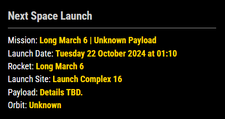

# MMM-SpaceLaunch
 
A [MagicMirror²](https://github.com/MagicMirrorOrg/MagicMirror) module that displays the next scheduled spacecraft launch



## Installation

Clone this module into your MagicMirror² modules folder:

```bash
cd ~/MagicMirror/modules
git clone https://github.com/TouaregWarrior/MMM-SpaceLaunch
```

## Configuration

To configure, copy the sample into your config.js and set each option to true or false to show/hide the detail line.


Example config.js entry should look like

```js
{
    module: "MMM-SpaceLaunch",
    position: "top_right",
    config: {
        showMission: true,          // Show mission name
        showLaunchDate: true,       // Show launch date
        showRocket: true,           // Show rocket name
        showLaunchSite: true,       // Show launch site
        showLocation: false,        // Hide location
        showPayload: true,          // Show payload details
        showOrbit: true,            // Show orbit information
        showDetails: false          // Hide additional details
    }
},

```

## Update

Go to the module’s directory and pull the latest version from GitHub:

```bash
cd ~/MagicMirror/modules/MMM-SpaceLaunch
git pull
```
